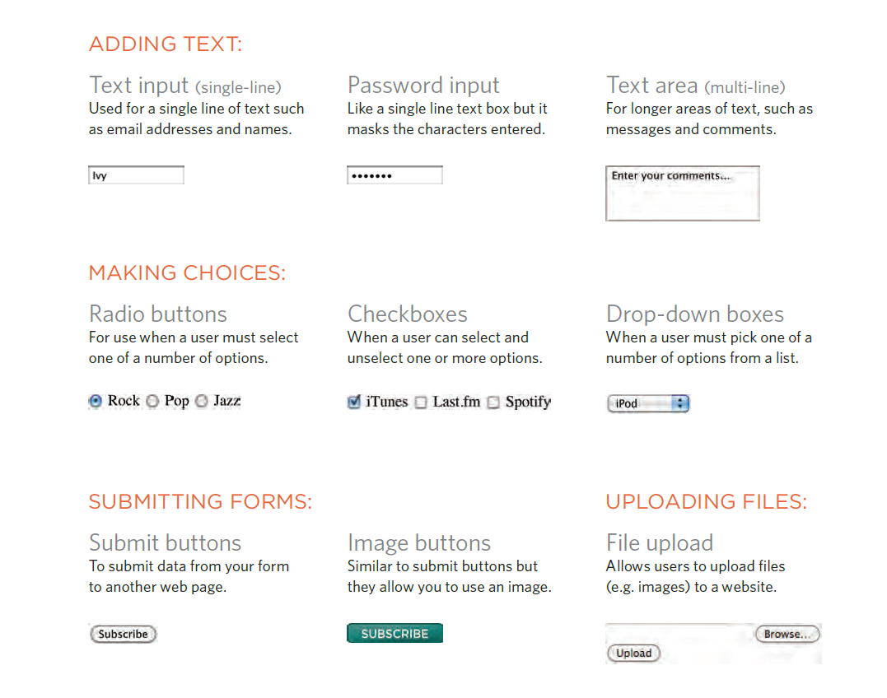

# Forms
Traditionally, the term 'form' has referred
to a printed document that contains
spaces for you to fill in information.

**Form Controls**

There are several types of form controls that
you can use to collect information from visitors
to your site:

**Form Structure** `form`
Form controls live inside a
`<form>` element. This element
should always carry the action
attribute and will usually have a
method and id attribute too.
action

Every `<form>` element requires
an `action` attribute. Its value
is the URL for the page on the
server that will receive the
information in the form when it
is submitted.

`method`
Forms can be sent using one of
two methods: get or post.

**Text Input**
`<input>`

The `<input>` element is used
to create several different form
controls. The value of the type
attribute determines what kind
of input they will be creating.

`type="text"`
When the type attribute has a
value of text, it creates a singleline
text input.

`name`
When users enter information
into a form, the server needs to
know which form control each
piece of data was entered into.

`size`
The size attribute should not
be used on new forms. It was
used in older forms to indicate
the width of the text input
(measured by the number of
characters that would be seen).

`maxlength`
You can use the maxlength
attribute to limit the number
of characters a user may enter
into the text field.

**Password Input**
`<input>`
type="password"
When the type attribute has
a value of password it creates
a text box that acts just like a
single-line text input, except
the characters are blocked out.
They are hidden in this way so
that if someone is looking over
the user's shoulder, they cannot
see sensitive data such as
passwords.

`name`
The name attribute indicates
the name of the password input,
which is sent to the server with
the password the user enters.
size, maxlength
It can also carry the size and
maxlength attributes like the
the single-line text input.

# Lists, Tables 

**lists**
* An unordered HTML list
Unordered HTML List
An unordered list starts with the `<ul>` tag. Each list item starts with the `<li>` tag.

The list items will be marked with bullets (small black circles) by default
* ordered HTML list `<ol>`

Unordered HTML List
An unordered list starts with the <ul> tag. Each list item starts with the <li> tag.

Images for Bullets ist-style-image

`ul {list-style-image: url("images/star.png");}`

**Table Properties**
You have already met several
properties that are commonly
used with tables. Here we will
put them together in a single
example using the following:

`width` to set the width of the
table

`padding` to set the space
between the border of each table
cell and its content

`text-transform` to convert the
content of the table headers to
uppercase
`letter-spacing`, `font-size`
to add additional styling to the
content of the table headers

`border-top`, `border-bottom`
to set borders above and below
the table headers

`text-align` to align the writing
to the left of some table cells and
to the right of the others

`background-color` to change
the background color of the
alternating table rows

`:hover` to highlight a table row
when a user's mouse goes over it

# events
JavaScript's interaction with HTML is handled through events that occur when the user or the browser manipulates a page. When the page loads, it is called an event. When the user clicks a button, that click too is an event.mouseover an element .

Events are said to trigger a function or script. When the click event fires on any element it could trigger a script that enlarges the selected item. and there is a steps involved in getting it to trigger some JavaScript code Together known as event handling.first select the element then specify event then call the code.

Binding is the process of stating which event you are waiting to happen, and which element you are waiting for that event to happen upon. and there three way to bind elements we will work with traditional dom event handlers which All modern browsers understand this way of creating an event handler, but you can only attach one function to each event handler. and event listeners can deal with more than one function at a time

event object : tells you information about the event, and the element it happened upon

You can use event delegation to monitor for events that happen on all of the children of an element.

The most commonly used events are W3C DOM events.