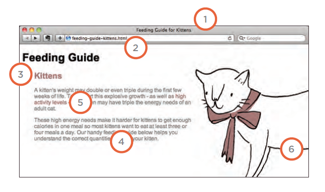

# Images

Images can improve the design and the appearance of a web page.

**Adding Images**

``

Height & Width
of Images

``

 Place Images
in Your Code:

1. 1: before a paragraph
The paragraph starts on a new
line after the image.
2. inside the start of a
paragraph
The first row of text aligns with
the bottom of the image.
3. in the middle of a
paragraph
The image is placed between the
words of the paragraph that it
appears in.

**Old Code: Aligning Images Horizontally**

align horizontally.html HTML
The align attribute was
commonly used to indicate how
the other parts of a page should
flow around an image.

The align attribute can take
these horizontal values:

**left**
This aligns the image to the left

**right**
This aligns the image to the right

**Old Code: Aligning Images Vertically**

**top**
This aligns the first line of the
surrounding text with the top of
the image.

**middle**
This aligns the first line of the
surrounding text with the middle
of the image.

**bottom**
This aligns the first line of the
surrounding text with the bottom
of the image.

**Three Rules for Creating Images**

1. Save images in the right format
2. Save images at the right size
3. Use the correct resolution

There are several tools you can use to edit and
save images to ensure that they are the right
size, format, and resolution.
The most popular tool amongst
web professionals is **Adobe Photoshop**

**Image Formats: JPEG**
Whenever you have **many different
colors** in a picture you should use **a JPEG**.

**Image Formats: GIF**
Use GIF or PNG format
when saving images
with few colors or large
areas of the same color.

**Image Dimensions**
The images you use on your website should be
saved at the same width and height that you
want them to appear on the page.

* REDUCING IMAGE SIZE
You can reduce the size of
images to create a smaller
version of the image.

- INCREASING IMAGE SIZE
***You can't increase the size of
photos significantly without
affecting the image quality.***

- CHANGING SHAPE
Only some images can be
cropped without losing valuable
information.

**Cropping Images**
When cropping images it is important not to
lose valuable information. It is best to source
images that are the correct shape if possible.

**Image Resolution**
Images created for the web should be saved at
a resolution of **72 ppi**. The higher the resolution
of the image, the larger the size of the file.

**Vector Images**
 are created by
placing points on a grid, and
drawing lines between those
points. A color can then be
added to "fill in" the lines that
have been created.

The advantage of creating line
drawings in vector format is that
you can **increase the dimensions
of the image without affecting
the quality of it.**

**Transparency**
Creating an image that is partially transparent
(or "see-through") for the web involves selecting one of two formats:
* Transparent GIF
* PNG 

**Checking the Size of Images**
right click on the image of website and open it in a new tab 
it will show under the image the size of image.

**Figure and Figure Caption**
`<figure>`
Images often come with
captions. HTML5 has introduced
a new `<figure>` element to
contain images and their caption
so that the two are associated.

**You can have more than one image inside the `<figure>`
element as long as they all share the same caption.**

The `<figcaption>` element has
been added to HTML5 in order
to allow web page authors to add
a caption to an image.

# Practical Information

Search Engine
Optimization (SEO )

SEO is a huge topic and several books have been written on the subject.
The following pages will help you understand the key concepts so you can
improve your website's visibility on search engines.

**The Basics**
Search engine optimization (or
SEO) is the practice of trying
to help your site appear nearer
the top of search engine results
when people look for the topics
that your website covers.

**On-Page Techniques**
On-page techniques are the
methods you can use on your
web pages to improve their
rating in search engines.

**Off-Page Techniques**
Getting other sites to link to you
is just as important as on-page
techniques. Search engines help
determine how to rank your
site by looking at the number of
other sites that link to yours.

**On-Page SEO**

1. Page Title
2. URL / Web Address 
3. Headings
4.  Text
5. Link Text  
6. Image Alt Text Page Descriptions  

How Many People Are Coming to Your Site?

1. Visits
2. Unique Visits
3. Page Views
4. Pages per Visit
5. Average Time on Site
3. Date Selector
4. Export

`Search engine optimization helps visitors find your
sites when using search engines.`

 `Analytics tools such as Google Analytics allow you to
see how many people visit your site, how they find it,
and what they do when they get there.`

`To put your site on the web, you will need to obtain a
domain name and web hosting.`

 `FTP programs allow you to transfer files from your
local computer to your web server.`

 `Many companies provide platforms for blogging, email
newsletters, e-commerce and other popular website
tools (to save you writing them from scratch).`

