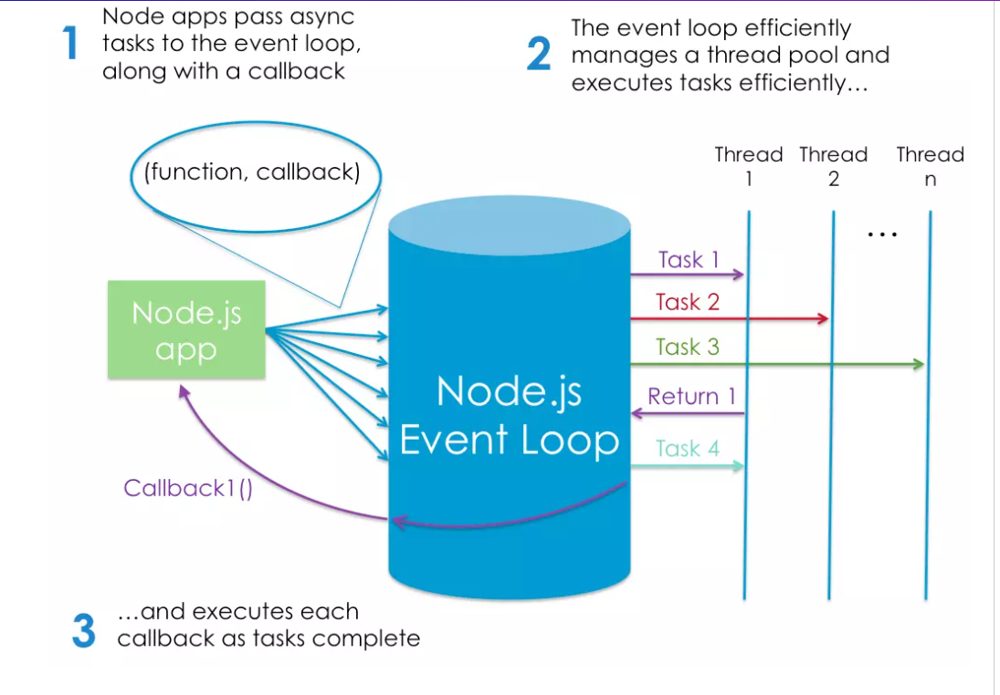

# Node.js
**Node.js** is a JavaScript runtime built on javascript in the back-end and  we can use to execute JavaScript on our computers


* NodeJS doesn't run in the browser only, we can use it to execute javascript on our computers without a browser, so its a Javascript runtime program.

* to install Node.js we will use version manager which it's a program that allows you to install multiple versions of Node and switch between them
* 
**Node Is Built on Google Chrome’s V8 JavaScript Engine**

**The V8 engine** is the open-source JavaScript engine that runs in Google Chrome and other Chromium-based web browsers, including Brave, Opera, and Vivaldi. It was designed with performance in mind and is responsible for compiling JavaScript directly to native machine code that your computer can execute.

 **npm, the JavaScript Package Manager**
*  Node comes bundled with a package manager called npm. To check which version you have installed on your system, type `npm -v`

* the package manager for JavaScript, npm is also the world’s largest software registry. There are over 1,000,000 packages of JavaScript code available to download,

 **to install package globally** 
1. `npm install -g jshint` 
2.  This will install the jshint package globally on your system
 This will install the jshint package globally on your system. We can use it to lint the index.js file from the previous example:
```js
jshint index.js
```

**Installing a Package Locally**
We can also install packages locally to a project, as opposed to globally, on our system. Create a test folder and open a terminal in that directory. Next type this:

`npm init -y`

This will create and auto-populate a package.json file in the same folder. Next, use npm to install the lodash package and save it as a project dependency:

`npm install lodash --save`

* NodeJS Has excellent support for modern JS 


 *  Should I Use Node.js when running JavaScript on the server.
which Node.js Execution Model , and it's event-driven ,which means that everything that happens in Node is in reaction to an event it  uses the *libuv* library to implement this asynchronous (that is, non-blocking) behavior.

* Node is particularly suited to building applications that require some form of real-time interaction or collaboration


* Advantages of Node.js: Speed, scalability, can be used on browsers and servers which you can easily share code between the server and the client,it uses JSON to speak and interact with databases (like mongoDB) and its ideally suited for consumption by a JavaScript program


**The following image depicts Node’s execution model:**



