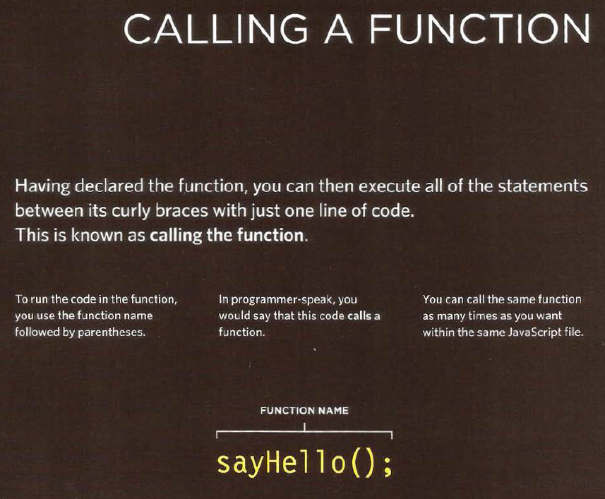

# FUNCTION
Functions let you group a series of statements together to perform a
specific task. If different parts of a script repeat the same task, you can
reuse the function (rather than repeating the same set of st atements).

* perform a task helps organize your code.
* functions also offer a way to store the steps needed to achieve a task.

If you are going to ask the function to perform its task later, you need to give your function **a name.** That name should describe the task it is performing. When you ask it to perform its task, it is known as **calling the function**. 

When you write a function and you expect it to provide you with an answer, the response is known as **a return value.**

## JavaScript Function Syntax
A JavaScript function is defined with the function keyword, followed by a name, followed by parentheses ().

Function names can contain letters, digits, underscores, and dollar signs (same rules as variables).

The parentheses may include parameter names separated by commas:
(parameter1, parameter2, ...)

The code to be executed, by the function, is placed inside curly brackets: {}

**function name(parameter1, parameter2, parameter3) {**

  **// code to be executed**
**}**

## DECLARING A FUNCTION:

