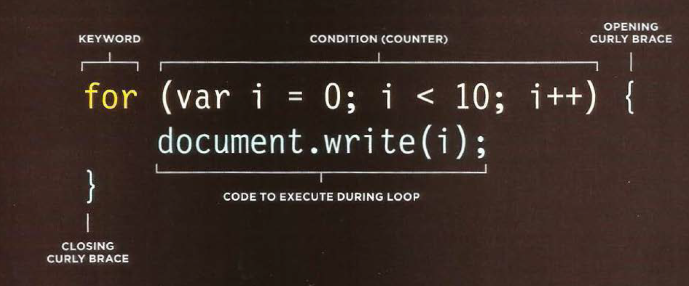

# COMPARISON OPERATORS
EVALUATING CONDITIONS You can evaluate a situation by comparing one value in the script to what you expect it might be. The result will be a Boolean: true or false.

* >== is equal to

* >!= is not equal to
* >=== strict equal to
* >!== strict not equal to
- >  (>) greater than
* > < less than 
* > (>=) greater than or equal to
* > <= less than or equal to

## Logical Operators
> Logical and &&

> Logical or ||

> Logical not !

## LOOPS
Loops check a condition. If it returns **true**, a code block will **run**. Then the condition will be **checked again** and if it **still** **returns true**, the code block will **run again**. It **repeats** until the condițion returns **false.**

 ### There are three common types of loops:
 >FOR 

>WHILE

 >DO WHILE 

- **FOR** 

  If you need to run code ***a specific number of times***, use a **for loop**. (It is the most common loop.) 

- **WHILE**

   If you **do not know how many times the code should run**, you can use a ***while loop***. Here the condition can be something other than a counter, and **the code will continue to loop for as long as the condition is true.**

* **WHILE DO**
The do...while loop is very similar to the while loop, but has one key difference: **it will always run the statements inside the curly braces at least once, even if the condition evaluates to false.**

### LOOPS COUNTERS
1. INITIALIZATION
> creat a variable and set it 0 

     var = 0

2. Condition 

the loop should continue to until the counter reach a specific number.
> for example: i>25

3. UPDATE 

 every time the loop has run it adds one to the counter.
 > i++
 
